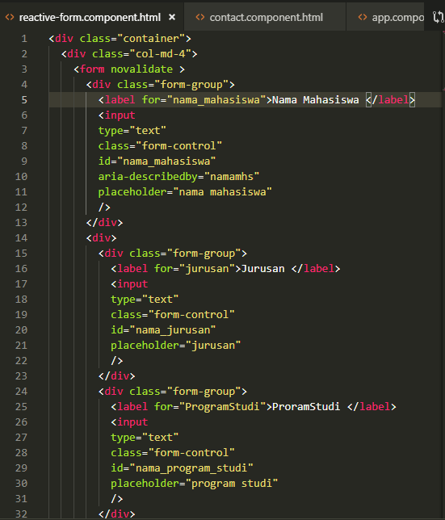
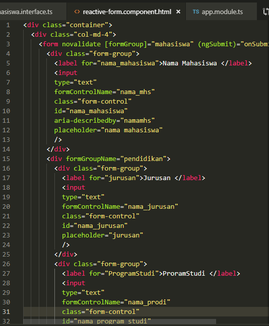
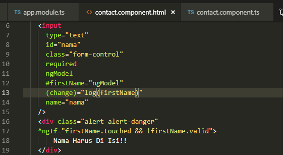
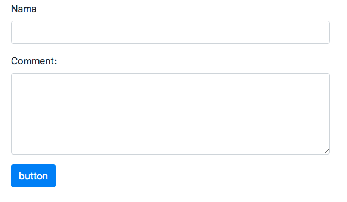

Bab 6
=====

Template-Driven Forms
=====================

Pada bab ini kita akan membahas penggunaan form dengan berbagai macam inputan,
menampilkan validasi error, dan perbedaan antara template-driven forms dengan
reactive form.

1.  **Membuat Form Boostrap**

    Pada sub bab ini kita akan membuat sebuah form dengan menggunakan bootstrap.
    Untuk lebih jelasnya ikuti langkah berikut

-   buatlah sebuah component dengan nama contact

-   buka file contact.component.html dan tambahkan code berikut:

    

-   buka file app.component.html dan tambahkan code berikut

    

-   jalankan servernya maka hasilnya seperti berikut

    

    1.  **Macam-Macam Form**

Dalam penggunaan form pada angular dapat menggunakan template-driven dan
reactive form. perbedaan antara template-driven dan reactive form adalah pada
reactive form biasanya juga disebut model-driven, penggunaan reactive form
menghindari penggunaan directive seperti ngModel, required dsb. Pada reactive
form ini menggunakan reactive-pattern, testing dan validasi yang bersifat
synchrous. Untuk lebih jelasnya kita buat sebuah contoh penggunakan reactive
form.

-   generate 2 buah component dengan nama reactive-form dan template-driven

-   buka file reactive-form.component.html dan buatlah code seperti berikut

    

    

-   buka file app.component.html dan tambahkan code berikut

    

-   sehingga hasilnya seperti berikut

    

-   langkah berikutnya buatlah sebuah interface dengan nama
    mahasiswa.interface.ts dan tambahkan code berikut

    

-   Dikarenakan untuk menggunakan reactive-forms diperlukan FormBuilder dan
    FormGroup dari module ReactiveFormsModule maka kita harus tambahkan
    ReactiveFormModule dan FormGroup pada app.module.ts seperti pada gambar
    berikut

    

-   buka file reactive-form.component.ts, import terlebih dahulu FormBuilder dan
    FormsGroup dan tambahkan beberapa code berikut

    

    

    

-   buka file reactive-form.component.html dan modifikasi codenya menjadi
    seperti berikut

    

    

    

-   jalan server localhost maka hasilnya seperti berikut

    

Percobaan diatas adalah penggunaan form menggunakan reactive-form untuk
berikutnya kita akan membuat form menggunakan template-driven. Untuk lebih jelas
ikuti langkah berikut ini:

-   untuk template-driven kita membutuhkan FormsModule pada app.module.ts, jadi
    buka file app.module.ts dan tambahkan FormsModule

    

-   buka file template-driven.componentn.ts dan tambahkan struktur form seperti
    berikut

    

-   buka file template-driven.component.html dan tambahkan code berikut

    

    

-   tambahkan method onSubmit pada template-driven.component.ts

-   buka file app.component.html tambahkan code berikut

    

-   hasil

    

    jika kita lihat hasilnya sama tetapi penggunaan directivenya yang berbeda

    1.  **ngModel**

        ngModel adalah sebuah directive untuk binding data atau value ke
        variable, semisalnya terdapat kode seperti berikut :

-   *[(ngModel)]=”nama”*

    berarti value/nilai yang ada pada input yang memilki attribute tersebut akan
    masuk kedalam variable nama. Sebagai pembuktian lakukan beberapa percobaan
    berikut :

-   buka file contact-form.component.html dan tambahkan ngmodel seperti berikut

    

-   buka file contact-form.component.ts dan tambahkan decorator input ( line 9
    dan 10)

    

-   coba jalan servernya dan lihat terdapat pesan error seperti pada gambar
    berikut

    

    penjelasan error : hal ini disebabkan jika kita menggunakan ngModel maka
    kita harus menambahkan atribut name pada tag tersebut

-   tambahkan atribut name pada tag input

    

-   jalankan servernya ( cat:tidak perlu diklik button untuk menampilkan data
    karena tidak menggunakan event binding jadi inputan akan langsung tampil
    saat user memasukan data)

-   buka file app.component.html

-   Buka file app.modules.ts

kita juga dapat melihat properties pada ngModel, Untuk lebih jelasnya ikuti
langkah bertikut

-   buka file contact.component.html modifikasi code berikut ini:

    

    Pada textarea tambahkan juga ngModel seperti pada gambar berikut line 43

    

-   buka file contact.component.ts modifikasi code berikut ini

-   jalankan server dan lihat pada inspect maka akan muncul property dari
    ngModel

    

    Penjelasan gambar

-   jika kita click pada (…) pada control maka akan muncul FormControl dan
    dimana terdapat instance dari FormControl Class di angular. Sebagai contoh
    ada property dirty yang digunakan untuk menentukan jika nilai dari inputan
    field berubah. jika kita click maka nilainya true hal ini karenakan kita
    memasukkan value di input field dan ada perubahan inputan sehingga dirty
    bernilai true

-   sedangkan kebalikan dari property dirty adalah pristine dan bernilai false

    1.  **Validasi**

        Pada sub bab ini kita akan membuat sebuah validasi dengan menggunakan
        bantuan directive, untuk lebih jelasnya ikuti langkah berikut

-   buka file contact.component.html dan tambahkan code berikut

    

    

-   jalankan localhost dan lihat hasilnya

    

-   jika kita jalankan maka secara default alert akan muncul. Untuk itu kita
    membutuhkan sebuah kondisi lagi. Buka file contact.component.html dan
    tambahkan code berikut (line 39)

    

-   jalankan localhost pada saat dijalankan maka secara default alert tidak akan
    muncul dan pada saat field nama dikosongkan maka akan muncul alert “Nama
    harus diisi”

    

    

    1.  **spesific validasi error**

        Ada beberapa macam untuk validasi error seperti minlength, maxlength,
        pattern dan required. Untuk lebih jelasnya ikuti langkah-langkah berikut
        :

-   buka file conctact.component.html dan tambahkan beberapa code berikut

    

    penjelasan code :

-   line 32 minlength adalah min abjad yang harus diisi

-   line 33 maxlenth adalah max panjang abjad

-   line 34 pattern adalah yang harus diisi

-   line 44 ngif (error required) adalah sebuah kondisi jika line 42 tidak
    terpenuhi

-   line 45 ngif (error minlength) adalah sebuah kondisi dimana nama kurang dari
    3 abjad

-   linr 47 ngif (error pattern) adalah sebuah kondisi dimana jika inputan user
    tidak sesuai dengan patternnya

-   jalankan localhost jika kita masukkan angka 1

    

jika kita inspect element maka pada bagian property errors terdapat jenis-jenis
validasi yang digunakan seperti pada gambar berikut

1.  **styling Invalid input field**

    Kita dapat menambahkan sebuah style pada input fieldnya sebagai contoh jika
    terdapat error maka selain menampilkan. Untuk lebih jelasnya ikuti langkah
    berikut

-   jika kita inspect element pada tab element dan kita click pada bagian form
    validation, maka pada element akan menunjukkan sebuah code angular
    ng-content class ng-invalid,ng-dirty dan ng-touched.

-   pada sub bab ini kita akan memodifikasi agar selain muncul alert pada form
    input akan merah juga

    

-   buka file contact.component.css dan tambahkan code berikut

    

-   jalankan localhost jika kita inputkan salah

**ngForm**

ngForm adalah directive Angular yang penting untuk membuat template-driven
forms. Mari kita mulai dengan ngForm dulu. Berikut adalah kutipan tentang ngForm
dari dokumentasi Angular.

Directive NgForm melengkapi elemen form dengan fitur tambahan. Ini memegang
kendali yang kamu buat untuk elemen dengan directive ngModel dan atribut name,
dan memonitor properti mereka, termasuk keabsahannya. Ini juga memiliki
properti valid sendiri yang mana hanya benar *jika setiap kontrol yang
terkandung* itu benar. Untuk lebih jelasnya ikuti langkah-langkah berikut :

-   buka file contact.component.ts dan tambahkan sebuah method submit seperti
    pada gambar berikut (line 23-25)

    

-   buka file contact.component.html dan buatlah sebuah template variabel ngForm
    atau property ngForm dengan nama form (\#form) yang nanti digunakan sebagai
    parameter dari method submit seperti pada gambar berikut (line 24)

-   pada button rubah codenya menjadi \<button type="submit" class="btn
    btn-primary"\>

-   jalankan localhost dan inspect element, masukkan pada field nama adalah
    pisang dan tambahkan pada text area kata-kata setelah itu tekan button. Maka
    pada saat di inspect element pada ngform property value:object terdapat
    nilai dari yang diinputkan user seperti pada gambar berikut

    

    1.  **ngModelGroup**

        Terkadang kita bekerja dengan banyak form dan kita ingin membuat
        beberapa group dalam form tersebut sebagai contoh kita ingin inputan
        nama sebagai modelGroup sendiri maka lakukan hal berikut:

-   buka file **contact.component.html** dan tambahkan code seperti berikut

1.  **Disabling the submit button**

>   Kita dapat membuat atau mengkondisikan button submit seperti button submit
>   tidak akan dapat diklik jika nilai validnya sama dengan false. Untuk lebih
>   jelasnya ikuti langkah berikut **( kondisikan contact.component.html seperti
>   semula sebelum menggunakan ngFormGroup )**

-   buka file contact.component.html dan tambahkan code berikut pada tag button

    

-   jalankan localhost jika berhasil secara default button akan disable, button
    akan enable saat terdapat inputan

    

    1.  **bekerja dengan check box**

        Kita juga dapat menambahkan check box pada angular seperti berikut

-   buka file contact.component.html dan tambahkan code check box seperti pada
    gambar berikut (line 66-73)

    

-   jalankan localhost

    

    1.  **bekerja dengan drop-down list**

        selain menggunakan check box kita juga dapat menggunakan dropdown list.
        Untuk lebih jelasnya ikuti langkah berikut

-   buka file contact.component.html tambahkan code untuk dropdown list seperti
    pada gambar berikut

    

-   buka file contact.component.ts dan tambahkan code berikut (line 21-24)

    

jalankan localhost maka hasilnya seperti berikut

-   Selain itu kita juga dapat menampilkan property id dan property nama dengan
    menggunakan property ngValue seperti berikut

    

    sehingga hasilnya seperti berikut

    

    selain itu juga kita dapat menggunakan multiple (line 74) jika ingin memilih
    keduanya seperti pada gambar berikut

    

    sehingga hasilnya seperti berikut (tekan control untuk dapat memilih
    keduanya)

    

    1.  **bekerja dengan radio button**

        Selain menggunakan check box dan dropdown list kita juga dapat
        menggunakan radio button, seperti berikut

-   buka file contact.component.html dan tambahkan code berikut (line 83-94)

-   catatan jika kita tidak menambahkan ngModel (line 85 dan line 91) pada input
    maka saat kita memilih salah satu radio button value tidak bisa muncul

    

-   jalankan localhost (menggunakan ngModel)

    

-   jalankan localhost (tanpa menggunakan ngModel)

    

    atau kita bisa menggunakan directive ngFor untuk menampilkan value seperti
    berikut

    

    sehingga hasilnya juga sama

    
