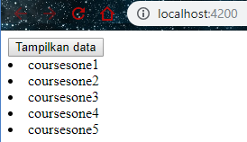

**ngIf**

Cara pertama

Contoh Kedua menggunakan else:

jalankan localhost dengan kondisi array pada app.component

dengan array kosong

Hasilnya :

Dengan array ada isi

Hasilnya :

Cara ketiga :

\- buka file app.component.html modifikasi kodenya menjadi berikut

Dengan array kosong

Hasilnya :

**Hidden property**

Hasilnya :

selain contoh diatas kita juga dapat memberikan property seperti berikut

dengan catatan pada app.component.ts pada courses terdapat array courses dengan
nilai 1 dan 2

Jika kita inspect element maka akan terlihat property hidden tidak terdapat
kondisi true ataupun false.

**ngSwitchCase**

buka file app.component.html modifikasi codenya menjadi seperti berikut

buka file app.component.ts tambahkan property viewMode

run localhost maka hasilnya seperti berikut saat diklik list view maka akan
muncul list view content dan jika kita pilih ListView maka akan tampil tulisan
List View Content

**ngFor**

buka app.component.ts property CoursesFor yang berisikan array

\- buka file app.component.html tambahkan directive ngFor pada element li

\- kita juga dapat memberi tanda tertentu pada index yang bernilai ganjil dengan
menggunakan isEven <https://angular.io/api/common/NgForOf>

**ngFor dan change Detection**

Dengan memodifikasi directive ngFor kita dapat melakukan penambahan atau
pengurangan data. Untuk lebih jelasnya ikuti langkah berikut :

-   Pada percobaan ini kita akan menambahkan sebuah data array pada coursesFor

-   tambahkan button pada app.component.html

tambahkan method **onAdd()**

Jika kita tekan button add maka akan ditambahkan sebuah data courses 6

\- Setelah kita berhasil menambahkan sebuah data array pada courseFor maka untuk
selanjutnya kita akan mencoba untuk melakukan penghapusan data.

\- Tambahkan sebuah method onRemove pada app.component.ts

\- Buka app.component.html dan tambahkan sebuah **button** untuk menghapus (Line
107)

penjelasan code : - **line 107** adalah sebuah button dimana terdapat event
click yang memanggil method onRemove dengan parameter item - hasilnya seperti
berikut (pada saat button remove diclick maka salah satu data akan hilang
sementara)

\- selain itu kita juga dapat melakukan perubahan status menggunakan event click
- buka file app.component.html tambahkan button (line 108)

penjelasan code :

\- pada line 108 terdapat sebuah button dan event click dimana event click ini
memanggil method onChange dengan parameter item

\- buka file app.component.ts buatlah sebuah method onChange dengan parameter
item dan didalam method tersebut adanya perubahan string menjadi updated

\- hasilnya

**6.1 ngFor dan trackby**

Pada studi kasus berikut ini kita akan menampilkan isi array saat button
diclick. Pemasalahan yang muncul jika button click tersebut diclick
berkali-kali, maka secara tidak langsung data akan mereload ulang. Untuk lebih
jelasnya ikuti langkah berikut:

\- Buka file app.component.ts buatlah sebuah method dengan nama loadCourses
(line 32) tapi sebelumnya buat sebuah property dengan nama coursesForOne (line
31)

\- buka file app.component.html dan tambahkan code seperti pada gambar

\- hasilnya saat button diclick

sekarang kita lakukan analisa buka inspect element, saat button belum diclick
seperti pada gambar berikut

dan saat button diklik maka element ul akan muncul seperti pada gambar berikut

\- jika kita lakukan klik kembali maka button akan merespon kembali dengan
menampilkan data yang sudah ada dalam arti mengunduh ulang yang sudah ada (jika
kita lakukan klik kembali maka pada inspect element akan muncul highlight warna
ungu dimasing-masing element li)

\- oleh karena itu kita membutuhkan TrackBy yang nanti digunakan untuk mengecek
jika data sudah ada maka button tidak perlu melakukan actionnya kembali

\- untuk menambahkan TrackBy dengan cara menambahkan pada app.component.html
pada directive ngFor

Penjelasan code:

\- line 42 sebuah nilai kembalian jika itemone bernilai true maka itemone.id
akan ditampilkan dan jika itemone bernilai false maka itemone tidak terdefinisi

\- jika berhasil maka pada saat button tampilkan data diklik untuk kedua kalinya
pada inspect element tidak ada muncul highlight ungu pada masing-masing element
li

**Custom Directive**

pada directive kita juga dapat membuat sebuah custom directive, sebagai contoh
kita ingin membuat semua inputan pada textbox secara otomatis menjadi lowercase.
Untuk lebih jelasnya ikuti langkah-langkah berikut :

\- pertama kita harus membuat directive dengan nama input-format terlebih dahulu
dengan perintah seperti berikut

**ng g d input-format** =\> ng generate directive nama-directivenya

\- jika directive berhasil digenerate maka kita pastikan di app.module.ts pada
\@NgModule terdapat nama directive yang kita buat tadi

buka input-format.directive.ts dan tambahkan decorator HostListener seperti pada
gambar berikut

Penjelasan code :

\- line 1 kita tambahkan (mengimport) sebuah fungsi decorator HostListener agar
dapat menggunakan event DOM yang menyediakan method untuk menangani sebuah event
yang sedang berjalan. Untuk lebih jelasnya penggunaan HostListener buatlah 2
buah method dengan nama onfocus dan onblur

\- line 8 adalah sebuah method onfocus dengan menggunakan function decorator
\@HostListener dengan parameter event windows focus
(https://developer.mozilla.org/en-US/docs/Web/Events/focus) - line 9 sebuah
method onblur dengan menggunakan function decorator \@HostListener dengan
parameter event windows blur
(<https://developer.mozilla.org/en-US/docs/Web/Events/focus>)

\- Buka file app.component.html dan tambahakn code berikut

Penjelasan code – line 125 terdapat appInputFormat adalah selector pada
**inputformat.directive.ts**

\-Kita jalan localhost:4200 setelah itu lakukan percobaan click pada textbox dan
click diluar textbox. Amati dengan menggunakan console inspect element. Pada
saat kita click pada textbox maka pada console akan muncul onFocus tetapi jika
click diluar textbox maka console akan keluat onBlur

\- Setelah kita memahami fungsi dari decorator \@HostListener maka untuk
berikutnya kita akan mencoba membuat logika untuk merubah value dari textbox
menjadi lowercase

\- buka file input-format.directive.ts dan modifikasi codenya menjadi berikut

Penjelasan code :

\- line 8 kita membutuhkan sebuah reference untuk ke host element maka kita
tambahkan (inject) pada constructor reference object ElementRef. Dengan kata
lain ElementRef digunakan untuk mengakses DOM object

\- line 11 sebuah property dengan nama value dengan tipe data string yang berisi
sebuah property nativeElement pada class ElementRef

\- line 12 untuk merubah inputan menjadi huruf kecil semua - Jalankan localhost
dan berikan masukan dengan huruf besar semua setelah itu tekan tab, jika
berhasil maka valuenya akan berubah menjadi huruf kecil semua - atau kita bisa
menggunakan cara lain dengan menggunakan **property binding** - buka file
app.component.html dan tambahkan property binding dengan nama format

buka file input-format.directive.ts tambahkan decorator input dan modifikasi
codenya seperti pada gambar berikut

Penjelasan code

\- line 7 adalah sebuah decorator input dengan nama property format

\- line 14 – 16 adalah sebuah kondisi dimana jika format sama dengan lowercase
maka semua inputan akan dibuat menjadi huruf kecil semua sedangkan jika selain
lowercase maka akan dibuat huruf besar - --cat:format disini adalah kondisi di
**app.component.html**

atau kita juga dapat menggunakan cara lain yaitu menggunakan nama selector
sebagai property binding - buka app.component.hml modifikasi codenya menjadi
berikut

buka input-format.directive.ts dan tambahkan decorator input dengan parameter
appInputFormat

\- Jika dijalankan sebagai contoh kita memasukkan kalimat dengan huruf kecil dan
pada saat kita tab maka akan berubah menjadi huruf besar semua seperti berikut

